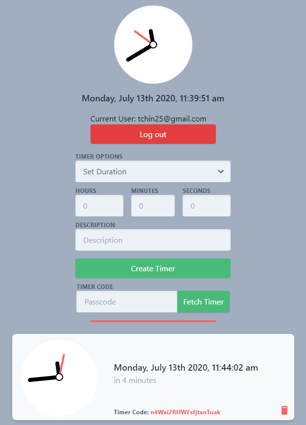
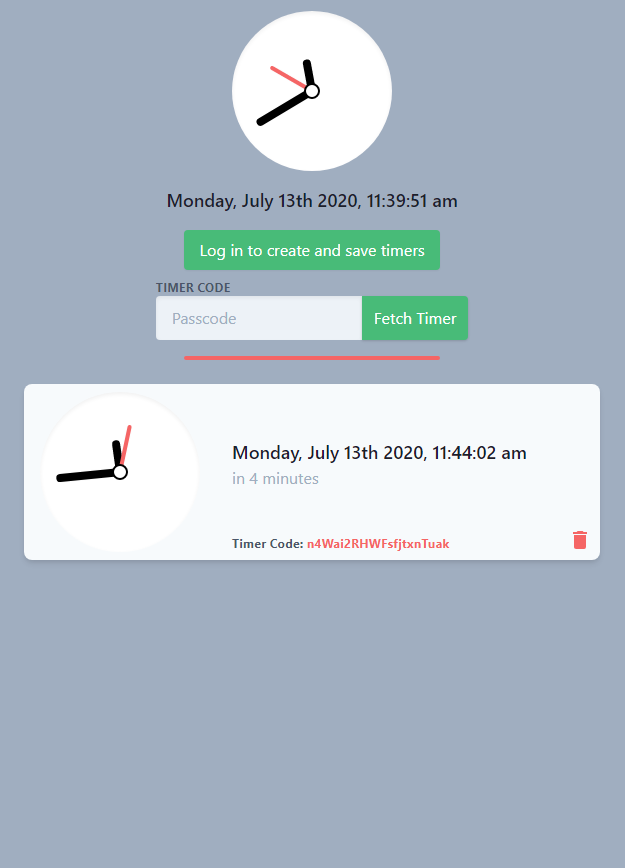

# Shared Timer

> - A Shared Timer built on React and Firebase
> - Users can log in and create and save timers, and guests can input timer codes to fetch timers
> - All backend interactions is done through cloud functions and the Firebase admin sdk
> - - Unfortunately, due to the way cloud functions work, cold start times will always be an issue until there's enough users that the functions are always running or until it's replaced with a node server 
> - Also includes an example of a scheduled cloud function for database cleanup in `functions/scheduledCleanup.js`

###*[Live Website Can Be Seen Here](https://sharedtimer.net)*

---

| User View | Guest View |
|:---------:|:----------:|
|||
*Screenshots subject to change as I actually try to make this site look pretty*

---
## Build Setup

```bash
# create Firebase project and initialize hosting, functions, and Firestore

# install dependencies
$ yarn install

# init Firebase with hosting from dist folder
# (assuming you have Firebase SDK already set up)
$ firebase init

# install cloud functions dependencies
$ cd functions
$ npm install

# replace Firebase config in src/firebase.js with your own config
# make sure your Firebase account is on the Blaze plan to enable cloud functions
# (or just downgrade functions to target NodeJS 8 runtime in functions/package.json)

# serve with hot reload at localhost:3000
$ yarn dev

# build for production and deploy
$ yarn build && firebase deploy
```